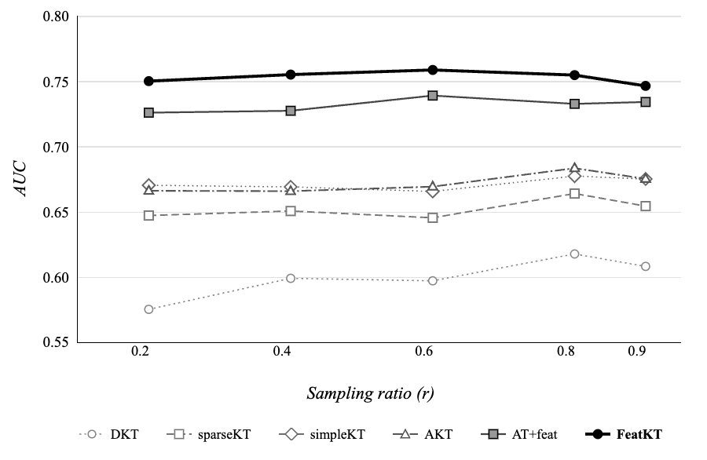
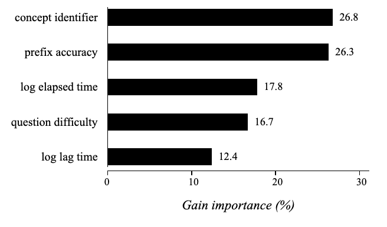

<h1 align="center">
  <b>FeatKT</b> 
</h1>

  A Feature-Driven Gradient Boosting Model for Multi-Step Knowledge Tracing on EdNet-KT1

  
  
  
  

FeatKT is a knowledge tracing model that predicts whether a student will answer a future question correctly. It uses LightGBM and five features derived from the student's observed learning history.

Setup instructions are in [INSTALL.md](INSTALL.md).

## Overview

- **Dataset:** EdNet-KT1, accessed through the Riiid Answer Correctness Prediction data
- **Sample:** 5,000 randomly selected students (seed 42), with all interactions retained for each selected student
- **Task:** Predict the remaining responses after observing a fixed prefix of a student's interaction history
- **Evaluation:** pyKT's non-accumulative multi-step (NAMS) protocol at prefix ratios 0.2, 0.4, 0.6, 0.8, and 0.9. Performance is measured with AUC
- **Model:** LightGBM with five features: concept identifier, question difficulty, log elapsed time, log lag time, and frozen prefix accuracy

## Results

FeatKT achieved a mean AUC of **0.747** across the five NAMS prefix ratios on the sampled EdNet-KT1 data.

<table width="100%">
  <tr>
    <td valign="center" width="42%">
      <table width="100%">
        <tr><th>Model</th><th width="100">Mean AUC</th></tr>
        <tr><td>DKT</td><td align="right" width="100">0.594</td></tr>
        <tr><td>sparseKT</td><td align="right" width="100">0.646</td></tr>
        <tr><td>simpleKT</td><td align="right" width="100">0.666</td></tr>
        <tr><td>AKT</td><td align="right" width="100">0.666</td></tr>
        <tr><td>AT + Features</td><td align="right" width="100">0.726</td></tr>
        <tr><td><b>FeatKT</b></td><td align="right" width="100"><b>0.747</b></td></tr>
      </table>
    </td>
    <td valign="center" width="58%">
      
    </td>
  </tr>
</table>

The notebook includes validation checks with five random seeds, a shuffled-label test, a train/test user-overlap check, and bootstrap comparisons with the feature-matched transformer.

## License

See [LICENSE](LICENSE).
